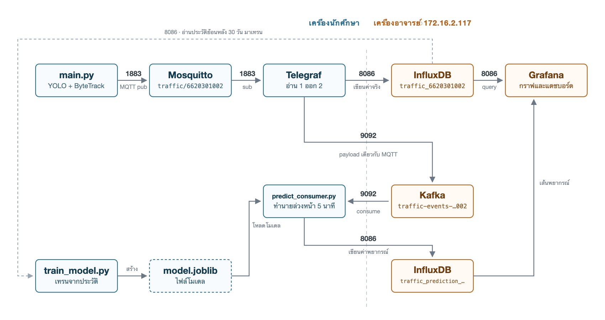

# ตรวจจับและพยากรณ์สภาพจราจรจากกล้อง CCTV

**ชื่อโปรเจกต์:** Traffic Congestion Index & 5-Minute Forecast

**ผู้จัดทำ:** นาย/นางสาว................................................ ID: 6620301002

**Repository:** https://github.com/kaewjamsai0193/IOT_PROJECT

---

## ระบบนี้ทำอะไร

อ่านภาพจากกล้อง CCTV มุมสูง ตรวจจับรถด้วย YOLO แล้วติดตามรถทีละคันด้วย ByteTrack
เพื่อวัดว่ารถวิ่งช้าแค่ไหน สรุปออกมาเป็นระดับความติดขัด 0-3 ทุก 10 วินาที

ข้อมูลที่ได้ส่งขึ้น MQTT แล้วแตกเป็นสองสาย สายแรกเข้า InfluxDB ให้ Grafana วาดกราฟสภาพปัจจุบัน
อีกสายเข้า Kafka ให้โมเดล ML อ่านไปทำนายว่าอีก 5 นาทีถนนจะติดแค่ไหน แล้วเขียนค่าพยากรณ์
กลับเข้า InfluxDB ที่เดิม คนดูจึงเห็นทั้งสภาพตอนนี้และแนวโน้มข้างหน้าในจอเดียว

สิ่งที่เราตัดสินใจต่างจากวิธีทั่วไปคือ ไม่ได้วัดรถติดจากจำนวนรถ แต่วัดจากความเร็ว
เพราะถนนที่มีรถ 15 คันวิ่งฉิวไม่ใช่รถติด ส่วนถนนที่มีรถ 12 คันจอดนิ่งคือรถติด

---

## สถาปัตยกรรม



*รูปที่ 1: ผังระบบทั้งหมด กล่องน้ำเงินรันบนเครื่องเรา กล่องส้มเป็นของกลางบนเครื่องอาจารย์*

| Layer | เครื่องมือ | หน้าที่ |
| :--- | :--- | :--- |
| Output & Presentation | Grafana | แสดงสภาพปัจจุบัน ค่าพยากรณ์ และกราฟเทียบความแม่น |
| Data Pipeline | Mosquitto, Telegraf, Kafka, InfluxDB | รับ payload แล้วกระจายเข้าฐานข้อมูลกับ Kafka พร้อมกัน |
| ML & Logic | YOLO26s + ByteTrack, RandomForest | ตรวจจับ วัดความเร็ว ตัดสินระดับ และพยากรณ์ 5 นาที |
| Edge & Sensing | คลิป CCTV / RTSP, Python + PyTorch | อ่านเฟรม ประมวลผล ส่ง payload ขึ้น MQTT |

---

## วิธีรัน

```bash
git clone https://github.com/kaewjamsai0193/IOT_PROJECT.git
cd IOT_PROJECT

python3 -m venv .venv
.venv/bin/python -m pip install -r requirements.txt

cp .env.example .env        # ใส่ INFLUX_TOKEN ที่อาจารย์แจก

docker compose up -d                        # Mosquitto + Telegraf
.venv/bin/python main.py longvideo.mov  # q หรือ ESC = ออก
.venv/bin/python predict_consumer.py        # สาย ML เปิดค้างอีกเทอร์มินัล
```

น้ำหนัก YOLO (`*.pt`) ไม่ได้อยู่ใน repo เพราะไฟล์ใหญ่ ultralytics โหลดให้เองตอนรันครั้งแรก
ส่วน `.env` ไม่ขึ้น git เพราะ repo เป็น public

---

## เอกสารแต่ละ Layer

- [1. Output_Presentation.md](1.%20Output_Presentation.md) — หน้าจอ Grafana ทั้ง 6 panel
- [2. ML_and_Logic.md](2.%20ML_and_Logic.md) — โมเดลตรวจจับ สูตรตัดสินรถติด และโมเดลพยากรณ์
- [3. Data_Pipeline.md](3.%20Data_Pipeline.md) — MQTT, Telegraf, Kafka และ InfluxDB
- [4. Edge_and_Sensing.md](4.%20Edge_and_Sensing.md) — แหล่งภาพและการส่งข้อมูลออกจาก Edge
