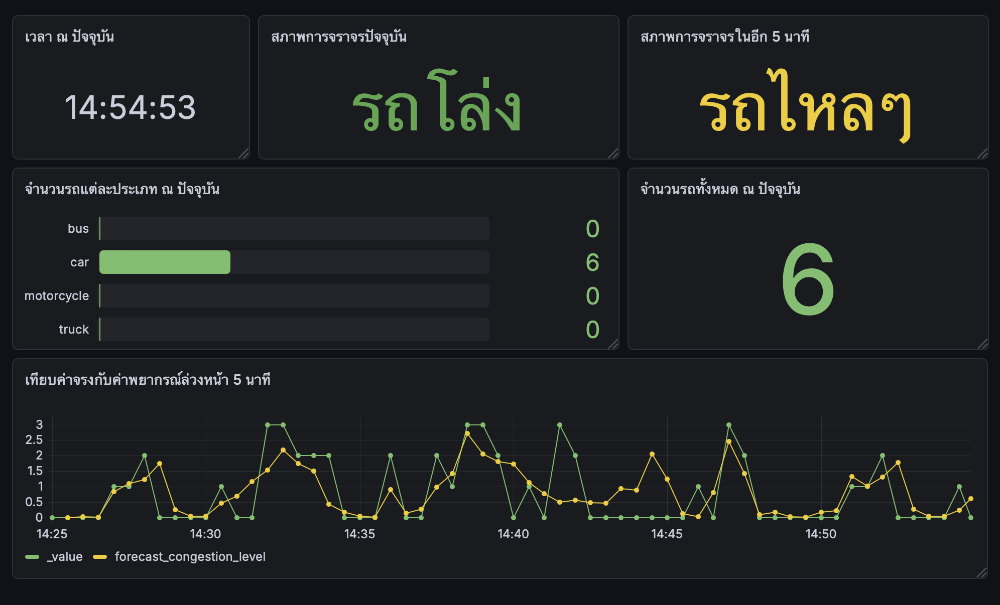
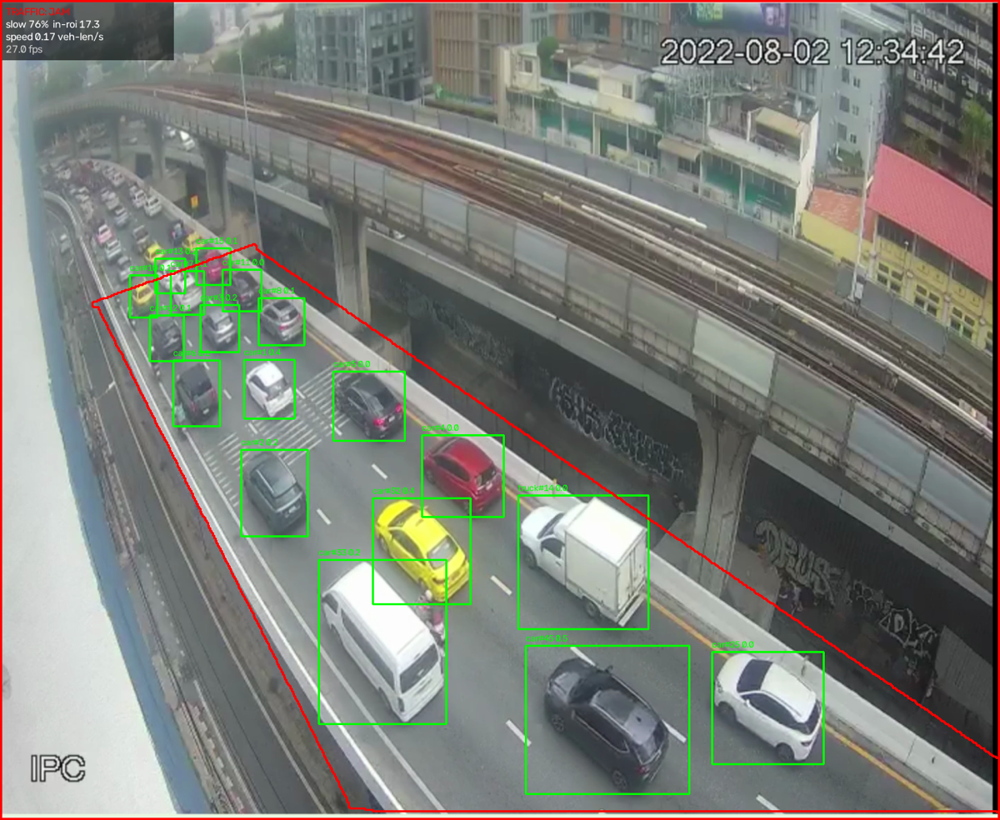

# Layer 1: Output & Presentation

## สิ่งที่ผู้ใช้ต้องการ

รู้สองอย่าง คือตอนนี้ถนนติดหรือโล่ง และอีก 5 นาทีจะเป็นยังไง เพราะรู้ตอนติดแล้วสายเกินจะเลี่ยง

อีกอย่างคือต้องรู้ว่าข้อมูลสดหรือค้าง เพราะระบบมีข้อมูลเฉพาะตอนที่ตัวตรวจจับทำงานอยู่

---

## หน้าจอ Grafana



*รูปที่ 1.1: หน้าจอจริง สถานะปัจจุบันรถโล่ง ค่าพยากรณ์อีก 5 นาทีคือรถไหลๆ*

| # | Panel | ข้อมูลที่ใช้ |
| :--- | :--- | :--- |
| 1 | เวลา ณ ปัจจุบัน | เวลาของข้อมูลล่าสุด ดูว่าสดหรือค้าง |
| 2 | สภาพการจราจรปัจจุบัน | `congestion_level` |
| 3 | สภาพการจราจรในอีก 5 นาที | `forecast_congestion_level` |
| 4 | จำนวนรถแต่ละประเภท | `car`, `motorcycle`, `bus`, `truck` |
| 5 | จำนวนรถทั้งหมด | `vehicles_in_roi` |
| 6 | เทียบค่าจริงกับค่าพยากรณ์ | ทั้งสอง measurement |

### การ map สี

| ช่วงค่า | ข้อความ | สี |
| :--- | :--- | :--- |
| 0 – 0.5 | รถโล่ง | เขียว `#73BF69` |
| 0.5 – 1.5 | รถไหลๆ | เหลือง `#EAB839` |
| 1.5 – 2.5 | รถหนาแน่น | ส้ม `#FFB357` |
| 2.5 – 3 | รถติด | แดง `#E24D42` |

ต้องใช้ Range mapping ไม่ใช่ Value mapping เพราะค่าพยากรณ์เป็นทศนิยม เช่น 1.53

สี่สีนี้ใช้กับระดับความติดขัดเท่านั้น panel จำนวนรถใช้สีอื่น เพราะวัดจากข้อมูลจริง 896 จุดแล้ว
การไล่สีตามจำนวนรถตรงกับระดับจริงได้มากสุด 73%

### กราฟเทียบความแม่น

ค่าพยากรณ์เขียนลงฐานข้อมูลที่เวลาต้นทาง ไม่ใช่เวลาที่ทำนายถึง ต้องเลื่อนไปข้างหน้า 5 นาทีก่อนถึงเทียบได้

```flux
import "date"

from(bucket: "mini_project")
  |> range(
    start: date.sub(d: 5m, from: v.timeRangeStart),
    stop: date.sub(d: 5m, from: v.timeRangeStop)
  )
  |> filter(fn: (r) => r._measurement == "traffic_prediction_6620301002")
  |> filter(fn: (r) => r.student_id == "6620301002")
  |> filter(fn: (r) => r._field == "forecast_congestion_level")
  |> group(columns: ["camera_id", "_field"])
  |> aggregateWindow(every: 30s, fn: mean, createEmpty: false)
  |> timeShift(duration: 5m)
  |> yield(name: "forecast")
```

เส้นค่าจริงต้องใช้ `aggregateWindow` ชุดเดียวกัน ไม่งั้นเป็นการเทียบค่าเฉลี่ย 30 วินาทีกับจุดดิบ 10 วินาที

---

## การแจ้งเตือน



*รูปที่ 1.2: สถานะ JAM ตีกรอบแดงรอบภาพ มุมซ้ายบนบอกรถช้า 76% และมีรถ 17.3 คัน*

| เงื่อนไข | ค่า |
| :--- | :--- |
| เริ่มเตือน | รถช้า ≥ 55% และมีรถ ≥ 4 คัน |
| เลิกเตือน | รถช้าต่ำกว่า 45% |
| ช่องทาง | กรอบแดงบนหน้าต่าง + บรรทัด `[JAM]` ใน stderr |

ที่ใช้เส้นเปิดกับเส้นปิดคนละค่า เพราะถ้าใช้เส้นเดียวสถานะจะกระพริบตอนค่าแกว่งรอบเส้น

ไม่มี payload แจ้งเตือนแยก สถานะไปกับ payload ปกติในรูป `congestion_level = 3`
ฝั่ง Grafana ไม่ได้ตั้ง alert rule ไว้
