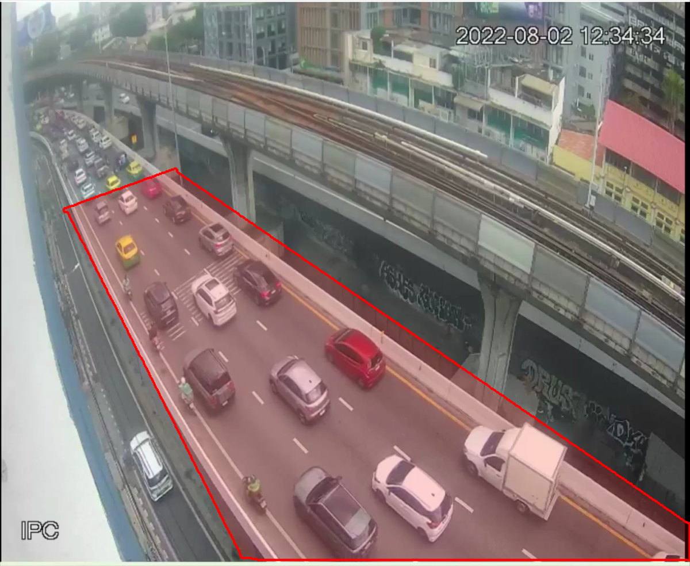

# Layer 2: ML & Logic

Layer นี้มีโมเดลสองตัว ตัวแรกคือ YOLO + ByteTrack ใช้ดูว่าตอนนี้ถนนเป็นยังไง
ตัวที่สองคือ RandomForest ใช้ทายว่าอีก 5 นาทีจะเป็นยังไง

---

## โมเดลตรวจจับ

ใช้ `yolo26s.pt` เป็นค่าเริ่มต้น (มี `yolov8s.pt` กับ `yolo11s.pt` ใน repo ไว้เทียบผล เปลี่ยนได้ด้วย `--model`)
จับ 4 ชนิดคือ car, motorcycle, bus, truck ที่ confidence 0.30 ขนาดภาพเข้าโมเดล 960 px
แล้วต่อด้วย ByteTrack

ที่ต้องมี tracker เพราะถ้าตรวจจับอย่างเดียวจะรู้แค่ว่าเฟรมนี้มีรถกี่คัน ซึ่งบอกไม่ได้ว่าติดหรือไม่ติด
พอให้ ID ประจำรถแต่ละคันได้ เราถึงเทียบตำแหน่งข้ามเฟรมแล้ววัดความเร็วได้ ซึ่งความเร็วคือตัวที่
แยกรถติดออกจากรถเยอะ

มีตัวกรองสัญญาณรบกวนอยู่สองสามจุด กล่องที่ใหญ่เกิน 25% ของเฟรมจะถูกตัดทิ้งเพราะมุมกล้องแบบนี้
ไม่มีทางมีรถคันเดียวกินพื้นที่ขนาดนั้น ชนิดของรถใช้วิธีโหวตสะสมทั้ง track ไม่ได้เชื่อผลเฟรมล่าสุด
กันกรณีรถคันเดียวถูกทายสลับไปมาระหว่าง car กับ truck ส่วน track ที่หายเกิน 0.25 วินาทีจะถูกลืมทิ้ง

---

## ขอบเขตถนนและสูตรตัดสิน



*รูปที่ 2.1: พื้นที่ ROI ที่วาดด้วยเส้นแดงในไฟล์ `mapreal.png` ระบบนับเฉพาะรถที่อยู่ในกรอบนี้*

ขอบเขตถนนวาดเป็นเส้นสีแดงลงบนภาพ `mapreal.png` โปรแกรมหาพิกเซลสีแดงแล้วเติมทึบข้างในเป็น mask
เวลาจะแก้ขอบเขตก็แค่วาดรูปใหม่ ไม่ต้องแก้โค้ด

จุดที่ใช้ตัดสินว่ารถอยู่ในขอบเขตไหม คือกึ่งกลางขอบล่างของกล่อง (ตรงล้อ) ไม่ใช่จุดกึ่งกลางกล่อง
เพราะกล้องกดลงมา รถที่อยู่นอกถนนแต่ตัวสูงจะมีจุดกึ่งกลางล้ำเข้ามาในถนนได้

**ขั้นที่ 1** วัดความเร็วรถแต่ละคัน หน่วยเป็นความยาวตัวรถต่อวินาที

$$v_{lps} = \frac{\sqrt{(x_t - x_{t-1})^2 + (y_t - y_{t-1})^2}}{h_{box} \times \Delta t}$$

ที่ต้องหารด้วยความสูงกล่องเพราะกล้องมีระยะใกล้ไกล รถที่อยู่ไกลขยับน้อยพิกเซลแต่ตัวก็เล็กตามไปด้วย
พอหารด้วยขนาดตัวเองแล้วรถใกล้กับรถไกลจะเทียบกันได้ด้วยเกณฑ์เดียว จากนั้นกรองด้วย EMA
ให้ค่านิ่งขึ้น ลดการสั่นของกรอบกล่อง

**ขั้นที่ 2** นับว่าในหน้าต่าง 5 วินาทีล่าสุด มีตัวอย่างที่ช้ากว่า 0.30 อยู่กี่เปอร์เซ็นต์ ได้เป็น `slow_vehicle_ratio`

**ขั้นที่ 3** แปลงเป็นระดับ

| สัดส่วนรถช้า | ระดับ | ความหมาย |
| :--- | :--- | :--- |
| ต่ำกว่า 20% | 0 | รถโล่ง |
| 20 – 34% | 1 | รถไหลๆ |
| 35 – 54% | 2 | รถหนาแน่น |
| 55% ขึ้นไป | 3 | รถติด |

ถ้ามีรถในพื้นที่ไม่ถึง 4 คัน ระดับจะถูกบังคับเป็น 0 เพราะสัดส่วนที่คิดจากรถคันสองคันไม่มีความหมาย
รถคันเดียวจอดรอเลี้ยวไม่ใช่รถติดทั้งถนน และค่านี้จะไม่เป็น null เด็ดขาด ถนนว่างก็คือถนนที่ไม่ติด
ถ้าปล่อยเป็น null ข้อมูลจะขาดช่วงทั้งบนกราฟและตอนเอาไปเทรน

---

## โมเดลพยากรณ์ 5 นาที

ใช้ RandomForestRegressor 300 ต้น ทำเป็น regression ไม่ใช่ classification เพราะอยากได้ค่าต่อเนื่อง
0.0-3.0 ค่า 1.4 กับ 1.6 ควรต่างกันแบบค่อยเป็นค่อยไป ไม่ใช่กระโดดข้ามคลาส

feature มี 20 ตัว คือค่าดิบ 7 ตัวจาก payload บวกค่าสถิติย้อนหลัง (ค่าเฉลี่ย 1 นาทีกับ 5 นาที
ค่าสูงสุด และผลต่างใน 5 นาที ของทั้งจำนวนรถและสัดส่วนรถช้า) แล้วบวกเวลาอีก 4 ตัว
เวลาแปลงเป็น sin/cos เพราะถ้าใส่ชั่วโมงเป็นเลข 0-23 ตรง ๆ โมเดลจะเห็น 23 กับ 0 ห่างกันสุดขั้ว
ทั้งที่จริงห่างกันชั่วโมงเดียว

ส่วน label คือค่า `congestion_level` จริงที่เวลา +5 นาที จับคู่ด้วย `merge_asof` ยอมคลาดเคลื่อนได้ 30 วินาที

สูตรสร้าง feature อยู่ใน `ml_features.py` ที่เดียว ทั้งตอนเทรนและตอนทำนายสดเรียกฟังก์ชันเดียวกัน
ถ้าแยกเขียนสองที่แล้วสูตรเพี้ยนจากกัน โมเดลจะเห็นข้อมูลคนละแบบกับตอนเทรนโดยไม่มีใครรู้

### ความแม่น

วัดจากข้อมูลจริงในระบบ ค่าจริง 345 จุดเทียบกับค่าพยากรณ์ 305 จุด

| วิธีวัด | MAE |
| :--- | :--- |
| โมเดลของเรา | 0.428 |
| เดาว่าอีก 5 นาทีเท่ากับตอนนี้ | 0.730 |
| เดาค่าเฉลี่ยตลอด | 0.962 |

ชนะทั้งสองเส้นฐาน แปลว่าโมเดลเรียนรูปแบบการเปลี่ยนแปลงได้จริง ไม่ได้แค่ลอกค่าปัจจุบันไปวาง
แต่ตัวเลขนี้มาจากคลิปเดียวประมาณหนึ่งชั่วโมง ถ้าจะเคลมความแม่นจริงต้องวัดจากกล้องสดหลายวัน

ที่ต้องระวังคือห้ามเอาข้อมูลจากคลิปที่เปิดวนซ้ำมาเทรน เพราะคลิปเดิมวนทุก N นาที
จะสอนให้โมเดลเชื่อว่ารถติดเป็นรอบตามความยาวคลิป ซึ่งไม่ใช่ความจริงของถนน

---

## ข้อมูลที่ส่งออกจาก Layer นี้

```json
{
  "timestamp": "2026-09-23T13:29:51+07:00",
  "camera_id": "CAM_BUILDING2_FL02",
  "student_id": "6620301002",
  "car": 17,
  "motorcycle": 1,
  "bus": 0,
  "truck": 1,
  "vehicles_in_roi": 19,
  "slow_vehicle_ratio": 0.8,
  "congestion_level": 3
}
```

ส่วนฝั่งพยากรณ์จะเขียนกลับเข้า InfluxDB เป็น `forecast_congestion_level` (ค่าต่อเนื่อง),
`forecast_level_rounded` (ปัดเป็นระดับ), `horizon_minutes`, `model_version`
และ `prediction_for` ซึ่งคือเวลาที่ค่านั้นทำนายถึง
