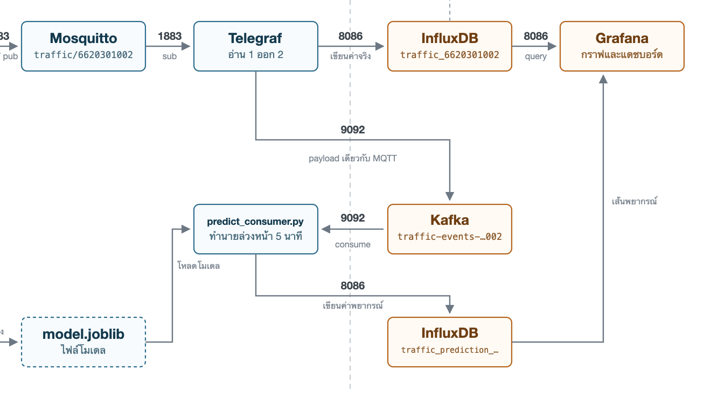

# Layer 3: Data Pipeline



*รูปที่ 3.1: ทางเดินของข้อมูลจาก Mosquitto ผ่าน Telegraf ออกสองทางพร้อมกัน*

ข้อมูลออกจากตัวตรวจจับเป็น JSON ก้อนเดียว เข้า Mosquitto ในเครื่องก่อน แล้ว Telegraf มาดึงไป
กระจายต่อเข้า InfluxDB กับ Kafka พร้อมกัน จุดที่แตกสองทางอยู่ที่ Telegraf ไม่ใช่ที่ Kafka
ข้อดีคือถ้าสาย ML ล่ม กราฟสถานะจริงก็ยังขึ้นตามปกติ

---

## MQTT

Mosquitto รันใน docker บนเครื่องเรา เปิดพอร์ต 1883 topic ที่ใช้คือ `traffic/6620301002`
ส่งด้วย qos 1 เพราะถ้าข้อความตกแล้วหายเลย ไม่มีทางอื่นที่ข้อมูลจะไปถึงปลายทางได้

ตอนแรกเคยส่งขึ้น VerneMQ กลางของวิชาอีกทางหนึ่งด้วย แล้วให้ Kafka Connect ดึงเข้า Kafka
ตอนนี้เลิกแล้วเพราะส่งเข้า Kafka ตรงได้ ไม่ต้องอ้อม

---

## Telegraf

ตัวกลางที่ทำงานหนักสุดในสายนี้ อ่านทางเดียวแต่เขียนออกสองปลายทาง ค่าที่ตั้งไว้แล้วสำคัญมีสี่จุด

`name_override` ตั้งชื่อ measurement เป็น `traffic_6620301002` ถ้าไม่ตั้งจะกลายเป็น `mqtt_consumer`
ตาม default ซึ่งชนกับของเพื่อนทั้งห้องเพราะใช้ bucket เดียวกัน

`tag_keys` ต้องระบุ `camera_id` กับ `student_id` เพราะ parser json ของ Telegraf ทิ้งค่า string
ทุกตัวที่ไม่ได้ระบุ ถ้าลืมใส่สองตัวนี้จะหายไปทั้งคู่ แล้วแยกไม่ออกว่าข้อมูลเป็นของใคร

`json_time_key` ให้ใช้เวลาที่กล้องตรวจจับ ไม่ใช่เวลาที่ Telegraf ได้รับ ข้อมูลเลยไม่เพี้ยน
แม้ Telegraf จะเทข้อมูลออกเป็นก้อนทุก 10 วินาที

`omit_hostname` ปิดการติด tag host เพราะใน container ค่านี้คือ container ID ที่เปลี่ยนทุกครั้ง
ที่สร้าง container ใหม่ ถ้าปล่อยไว้ InfluxDB จะมองเป็นคนละ series กราฟจะขาดเป็นท่อน

ฝั่งขาออกไป Kafka ต้องใส่ `json_transformation` เพิ่ม เพราะ Telegraf จะห่อข้อมูลเป็น
`{"fields":{...},"tags":{...},"name":...}` ซึ่งคนละรูปแบบกับที่ส่งขึ้น MQTT เราแปลงกลับให้แบนราบ
เหมือนเดิม ปลายทางจะได้เขียนโค้ดอ่านแบบเดียวใช้ได้ทั้งสองทาง

---

## Kafka

ต่อตรงไปที่ `172.16.2.117:9092` topic `traffic-events-6620301002` มี consumer group เดียว
คือ `traffic-ml-predictor-6620301002` ของ `predict_consumer.py`

เดิมต่อตรงไม่ได้เพราะ broker ประกาศตัวเองว่าอยู่ที่ `localhost:9092` เครื่องอื่นเลยเข้าไม่ถึง
client จะเด้งไปหา localhost ของตัวเองแล้ว timeout พอวันที่ 9 กันยายน อาจารย์แก้เป็น IP จริง
ก็ส่งตรงได้ตั้งแต่นั้น ถ้าวันไหนกลับไปเป็น localhost อีกจะส่งไม่ได้ทันที

ข้อความใน Kafka หน้าตาเหมือน payload บน MQTT ทุกฟิลด์ ต่างกันแค่เวลาเขียนเป็น UTC ลงท้ายด้วย Z
ส่วน MQTT เป็นเวลาไทยลงท้ายด้วย +07:00 ซึ่งคือวินาทีเดียวกัน

---

## InfluxDB

อยู่ที่ `172.16.2.117:8086` org `my-org` bucket `mini_project` ซึ่งใช้ร่วมกันทั้งห้อง
เพราะฉะนั้นทุก query ต้องกรอง `student_id` เสมอ ไม่งั้นได้ข้อมูลของเพื่อนปนมาด้วย

มีสอง measurement

| measurement | tags | fields |
| :--- | :--- | :--- |
| `traffic_6620301002` | `camera_id`, `student_id`, `topic` | `car`, `motorcycle`, `bus`, `truck`, `vehicles_in_roi`, `slow_vehicle_ratio`, `congestion_level` |
| `traffic_prediction_6620301002` | `camera_id`, `student_id` | `forecast_congestion_level`, `forecast_level_rounded`, `horizon_minutes`, `model_version`, `prediction_for` |

field ทุกตัวในตัวแรกเก็บเป็น float เพราะ parser json ของ Telegraf แปลงตัวเลขเป็น float ทั้งหมด
แก้ย้อนหลังไม่ได้ ต้องรู้ไว้ตอนเขียน query

ตัวอย่าง query ที่ใช้จริงบน Grafana

```flux
from(bucket: "mini_project")
  |> range(start: v.timeRangeStart, stop: v.timeRangeStop)
  |> filter(fn: (r) => r._measurement == "traffic_6620301002")
  |> filter(fn: (r) => r.student_id == "6620301002")
  |> filter(fn: (r) => r._field == "congestion_level")
  |> aggregateWindow(every: 30s, fn: mean, createEmpty: false)
```

---

## เรื่องจังหวะเวลา

ทั้งท่อมีตัวกำหนดจังหวะอยู่ตัวเดียวคือตัวตรวจจับที่ส่งทุก 10 วินาที ทอดที่เหลือไม่มีนาฬิกาของตัวเอง
ได้รับเมื่อไหร่ก็ส่งต่อเมื่อนั้น

ที่มักเข้าใจผิดคือ `interval = "10s"` ใน `telegraf.conf` ไม่ได้แปลว่าไปดึงข้อมูลทุก 10 วินาที
เพราะ `mqtt_consumer` เป็น service input คือนั่งรอรับอย่างเดียว ตัวที่เป็น 10 วินาทีจริงคือ
`flush_interval` ซึ่งเป็นรอบเทข้อมูลออกปลายทาง จำนวนจุดไม่เปลี่ยน แต่ข้อมูลอาจถึงช้ากว่า
เวลาใน timestamp ได้ถึง 10 วินาที
