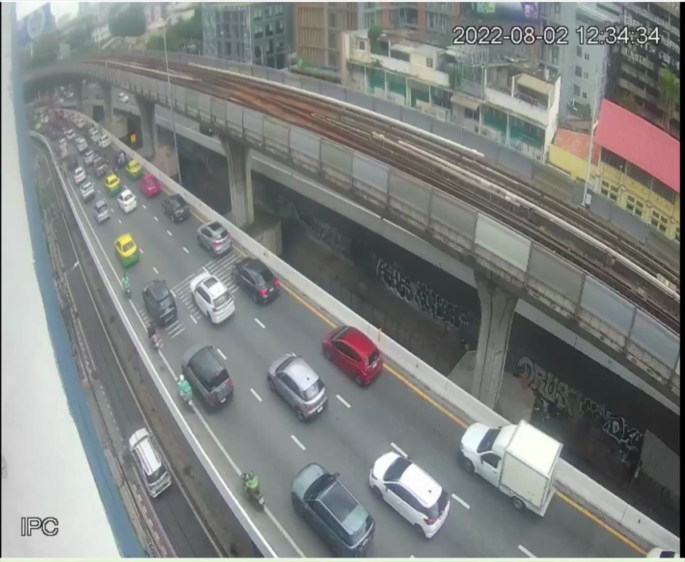

# Layer 4: Edge & Sensing

## แหล่งภาพ



*รูปที่ 4.1: ภาพดิบจากกล้องก่อนเข้ากระบวนการ เป็นมุมสูงกดลงมาที่ถนน*

ใช้คลิป CCTV มุมสูงเป็นแหล่งภาพหลักตอนพัฒนา ขนาด 1444x1184 ที่ 27 fps
โปรแกรมรับได้สามแบบคือไฟล์วิดีโอ, RTSP URL และเลขกล้องสำหรับ webcam
สั่งได้จากอาร์กิวเมนต์ตัวแรกเลย ไม่ต้องแก้โค้ด

```bash
.venv/bin/python main.py longvideo.mov          # ไฟล์
.venv/bin/python main.py rtsp://192.168.1.50/s  # กล้องสด
.venv/bin/python main.py 0                      # webcam
```

มุมกล้องแบบกดลงมาแบบนี้สำคัญกับโลจิกที่ใช้ เพราะรถที่อยู่ไกลจะเล็กกว่ารถที่อยู่ใกล้มาก
สูตรวัดความเร็วเลยต้องหารด้วยขนาดตัวรถเพื่อตัดผลตรงนี้ออก

---

## เครื่องที่ใช้ประมวลผล

รันบน MacBook ใช้ Apple Silicon ผ่าน PyTorch MPS โค้ดเลือก device ให้เองตามเครื่องที่มี
ถ้าเจอ CUDA ใช้ CUDA ถ้าไม่มีก็ MPS ถ้าไม่มีอีกก็ตกไปที่ CPU ย้ายไปรันบน Jetson หรือ PC
ที่มีการ์ดจอได้โดยไม่ต้องแก้อะไร

เพื่อให้ตามภาพทัน เราข้ามเฟรมเว้นหนึ่ง (`STRIDE = 2`) คือประมวลผลจริงราว 13 fps จาก 27 fps
ที่ทำได้เพราะรถไม่ได้เปลี่ยนตำแหน่งมากใน 1/27 วินาที การข้ามเฟรมเลยไม่ได้ทำให้ความเร็วที่วัดเพี้ยน
แต่ช่วยลดภาระเครื่องลงครึ่งหนึ่ง

ตอนอ่านจากไฟล์และเปิดหน้าต่างแสดงผล โปรแกรมจะหน่วงให้วิดีโอเล่นความเร็วปกติ
ข้อมูลที่ออกมาจึงห่างกัน 10 วินาทีจริงเหมือนกล้องสด ถ้าใส่ `--no-show` จะไม่มีการหน่วง
ประมวลผลเร็วสุดเท่าที่เครื่องไหว ข้อมูลจะถี่กว่า 10 วินาที ซึ่งไม่เหมาะจะเอาไปเทรนโมเดล

---

## การส่งข้อมูลออกจาก Edge

ส่งด้วย MQTT ไปที่ Mosquitto ในเครื่องเดียวกัน

- **Endpoint:** `mqtt://127.0.0.1:1883`
- **Topic:** `traffic/6620301002`
- **QoS:** 1
- **ความถี่:** ทุก 10 วินาที

```python
info = mqtt_client.publish(MQTT_TOPIC, payload_str, qos=1)
if info.rc != mqtt.MQTT_ERR_SUCCESS:
    print(f"ส่ง MQTT ไม่สำเร็จ {MQTT_TOPIC} (rc={info.rc})", file=sys.stderr)
```

ที่ต้องเช็ก `info.rc` ทุกครั้งเพราะ `publish()` ไม่โยน exception ตอนต่อ broker ไม่ได้
มันคืน rc = 4 เงียบ ๆ ถ้าไม่เช็กแล้ว Mosquitto ไม่ได้รันอยู่ ข้อมูลจะหายทั้งหมด
โดยไม่มีคำเตือนอะไรเลยบนหน้าจอ

ตอนโปรแกรมปิด จะส่ง payload ก้อนสุดท้ายก่อนก็ต่อเมื่อยังมีเฟรมค้างที่ยังไม่ได้สรุป
ถ้าเพิ่งส่งรอบล่าสุดไปแล้วจะไม่ส่งซ้ำ ไม่งั้นจะได้ payload ที่รถเป็น 0 ทุกประเภท
ปนเข้าฐานข้อมูลทุกครั้งที่ปิดโปรแกรม
