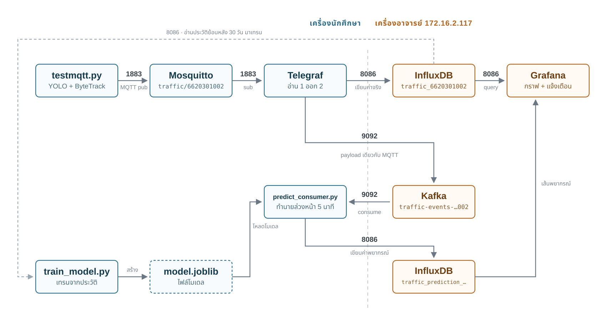

# IOT_PROJECT — ตรวจจับสภาพจราจรจากวิดีโอ แล้วทำนายรถติดล่วงหน้า 5 นาที

อ่านภาพจากกล้องหรือไฟล์วิดีโอ นับรถในขอบเขตถนนและวัดว่ารถวิ่งช้าแค่ไหนด้วย YOLO + ByteTrack
สรุปเป็นระดับความติดขัดหนึ่งค่าทุก 10 วินาที ส่งออกเป็น JSON ก้อนเดียวแล้วแตกไปสองสาย
สายหนึ่งเข้า InfluxDB ให้ Grafana วาดสถานะปัจจุบัน อีกสายเข้า Kafka ให้โมเดล ML
ทำนายว่าอีก 5 นาทีจะติดแค่ไหน แล้วเขียนค่าพยากรณ์กลับเข้า InfluxDB ที่เดียวกัน



กล่องสีน้ำเงินรันบนเครื่องเรา กล่องสีส้มเป็นของกลางบนเครื่องอาจารย์ `172.16.2.117`
เราไม่ได้รันเอง ต่อเข้าไปใช้อย่างเดียว

## อะไรโยงไปไหน

| ท่อน | จาก → ไป | ที่อยู่ / ชื่อ | ขนอะไร | ตั้งค่าที่ไหน |
|---|---|---|---|---|
| 1 | วิดีโอ/กล้อง → `testmqtt.py` | อาร์กิวเมนต์ตัวแรก | เฟรมภาพดิบ | บรรทัดคำสั่ง |
| 2 | `testmqtt.py` → Mosquitto | `127.0.0.1:1883` topic `traffic/6620301002` | payload JSON, qos 1 | ค่าคงที่ต้นไฟล์ `testmqtt.py` |
| 3 | Mosquitto → Telegraf | `mosquitto:1883` (ชื่อ service ใน docker) | payload เดิม | `[[inputs.mqtt_consumer]]` |
| 4 | Telegraf → InfluxDB | `:8086` → measurement `traffic_6620301002` | 7 fields + tag `camera_id`, `student_id`, `topic` | `[[outputs.influxdb_v2]]` + `INFLUX_TOKEN` |
| 5 | Telegraf → Kafka | `:9092` topic `traffic-events-6620301002` | payload แบนราบเหมือน MQTT (เวลาเป็น UTC) | `[[outputs.kafka]]` |
| 6 | Kafka → `predict_consumer.py` | group `traffic-ml-predictor-6620301002` | event สด | `KAFKA_*` ใน `.env` |
| 7 | `predict_consumer.py` → InfluxDB | measurement `traffic_prediction_6620301002` | ค่าพยากรณ์ +5 นาที | `PREDICTION_MEASUREMENT` |
| 8 | InfluxDB → `train_model.py` | อ่านย้อนหลังตาม `TRAIN_RANGE` | ประวัติไว้เทรน | `TRAIN_RANGE` ใน `.env` |
| 9 | `train_model.py` → `predict_consumer.py` | ไฟล์ `model.joblib` | โมเดล + รายชื่อ feature | `MODEL_PATH` ใน `.env` |
| 10 | InfluxDB → Grafana | datasource ของ Grafana กลาง | Flux query | ตั้งในหน้า Grafana |

คอขวดอยู่ที่ท่อน 2 ถ้า Mosquitto ไม่ได้รัน ข้อมูลหายตั้งแต่ต้นทางและทุกอย่างหลังจากนั้นเงียบหมด
วิธีไล่ดูทีละจุดอยู่ใน [docs/running.md](docs/running.md)

## เริ่มใช้งาน

```bash
python3 -m venv .venv
.venv/bin/python -m pip install -r requirements.txt
cp .env.example .env          # แล้วใส่ INFLUX_TOKEN ที่อาจารย์แจก
```

`.env` ถูก gitignore ไว้แล้ว **ห้าม commit ขึ้น repo เพราะ repo นี้เป็น public**
น้ำหนักโมเดล YOLO (`*.pt`) ไม่ได้อยู่ใน repo ultralytics โหลดให้เองตอนรันครั้งแรก

```bash
docker compose up -d                       # Mosquitto, Telegraf
.venv/bin/python testmqtt.py longvideo.mov # q หรือ ESC = ออก, space = หยุดชั่วคราว
.venv/bin/python predict_consumer.py       # สาย ML เปิดค้างไว้อีกเทอร์มินัล
```

รับภาพจากกล้องจริงใช้ `testmqtt.py 0` หรือ `testmqtt.py rtsp://…`
อาร์กิวเมนต์ที่เหลือและข้อควรระวังตอนรันอยู่ใน [docs/running.md](docs/running.md)

## ข้อมูลที่ส่ง

ก้อนเดียวใช้ทั้งระบบ ส่งขึ้น topic `traffic/6620301002` ทุก 10 วินาที

```json
{
  "timestamp": "2026-09-23T13:29:51+07:00",
  "camera_id": "CAM_BUILDING2_FL02",
  "student_id": "6620301002",
  "car": 17, "motorcycle": 1, "bus": 0, "truck": 1,
  "vehicles_in_roi": 19,
  "slow_vehicle_ratio": 0.8,
  "congestion_level": 3
}
```

| `congestion_level` | ความหมาย |
|---|---|
| 0 | FREE — โล่ง (รวมถึงตอนที่ไม่มีรถเลย) |
| 1 | MODERATE — เริ่มหนาแน่น |
| 2 | HEAVY — หนาแน่นมาก |
| 3 | JAM — ติด |

ตัวตัดสินระดับคือ `slow_vehicle_ratio` ไม่ใช่จำนวนรถ และค่านี้เป็นตัวเลขเสมอไม่มี `null`
ไม่งั้นข้อมูลจะขาดช่วงทั้งบนกราฟและในโมเดล

bucket `mini_project` ใช้ร่วมกันทั้งห้อง **ทุก query ต้องกรอง `student_id` เสมอ**

## ไฟล์ในโปรเจกต์

| ไฟล์ | หน้าที่ |
|---|---|
| `testmqtt.py` | ตรวจจับ ติดตาม ตัดสินสภาพจราจร แล้วส่ง payload ขึ้น MQTT |
| `ml_features.py` | สูตร feature ตัวเดียวกันที่ทั้ง train และ realtime เรียกใช้ |
| `train_model.py` | อ่านประวัติจาก InfluxDB แล้วสร้าง `model.joblib` |
| `predict_consumer.py` | อ่าน Kafka ทำนาย และเขียนผลกลับ InfluxDB |
| `test_payload.py`, `test_ml_features.py` | สคริปต์ assert ธรรมดา ไม่ต้องลง pytest |
| `docker-compose.yml`, `mosquitto.conf`, `telegraf.conf` | Mosquitto กับ Telegraf ในเครื่อง |
| `mapreal.png` | ภาพ ROI ที่วาดขอบเขตถนนด้วยเส้นสีแดง |
| `.env` | token ของ InfluxDB และค่าตั้งของสาย ML (ไม่ขึ้น git) |

คลิปทดสอบ (`*.mov`), น้ำหนัก YOLO (`*.pt`) และ `model.joblib` ไม่ได้เก็บใน repo สร้างใหม่ได้เอง

## เอกสารละเอียด

| ไฟล์ | เนื้อหา |
|---|---|
| [docs/running.md](docs/running.md) | อาร์กิวเมนต์, `--loop`, ความถี่ในการส่ง, ดักฟังข้อมูลทีละจุดเวลาไล่ปัญหา |
| [docs/ml.md](docs/ml.md) | โครงสร้างข้อมูลใน InfluxDB, วิธี train, fields ของค่าพยากรณ์ |
| [docs/grafana.md](docs/grafana.md) | Flux query ของแต่ละ panel และวิธี map สีให้ตรงกันทั้งแดชบอร์ด |
| `docs/superpowers/` | spec กับ plan เก็บเหตุผลเบื้องหลังการตัดสินใจ |
